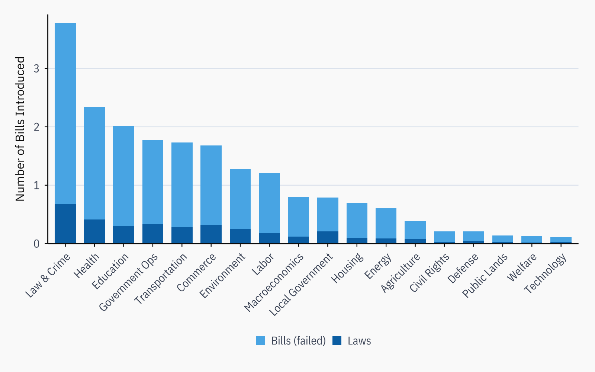
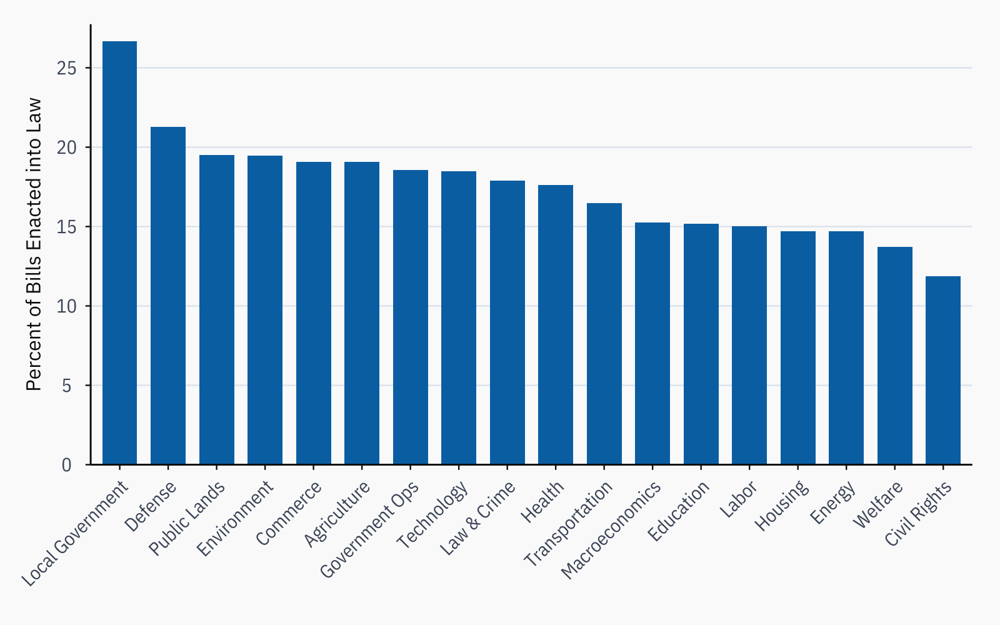
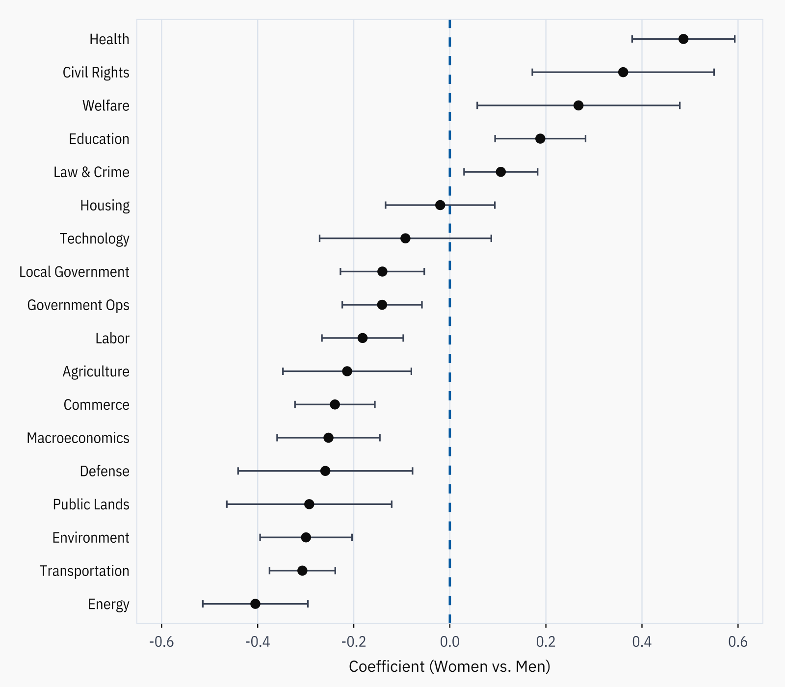
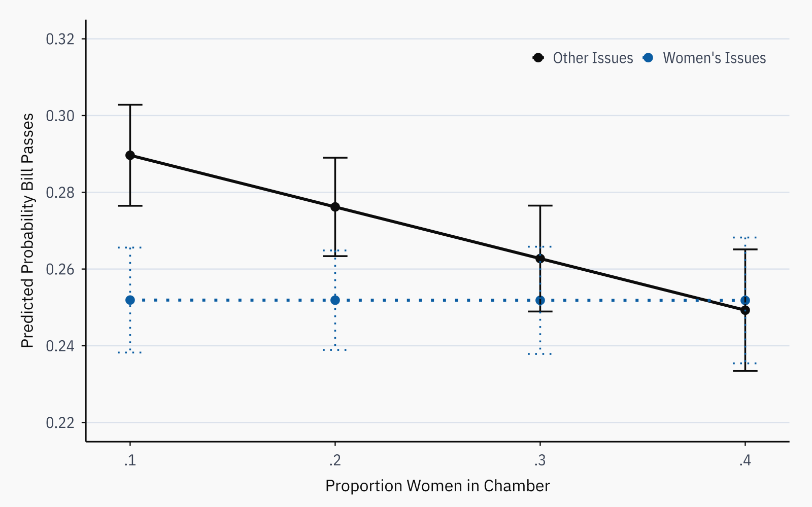
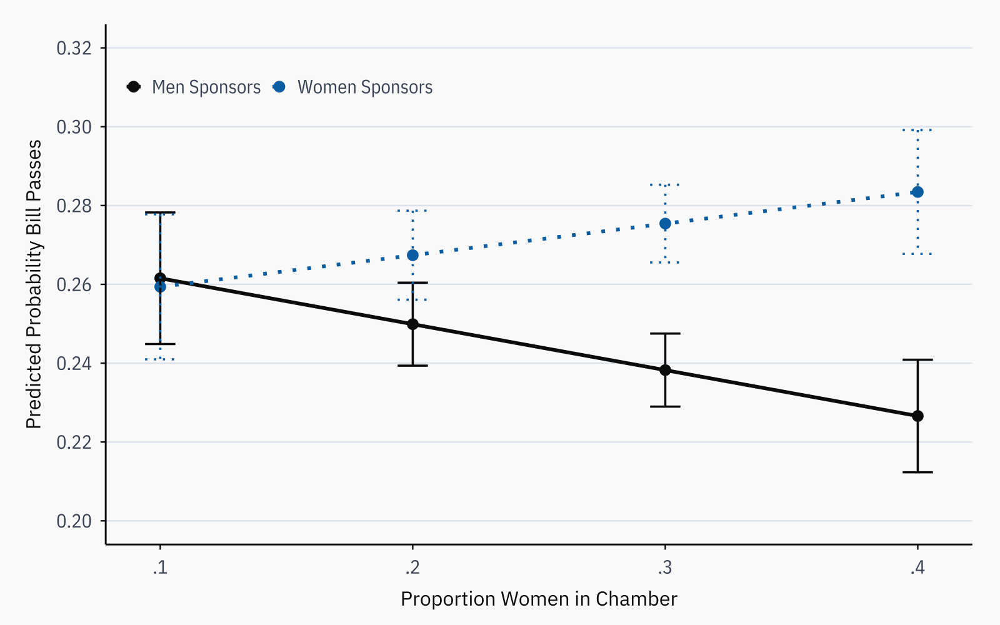
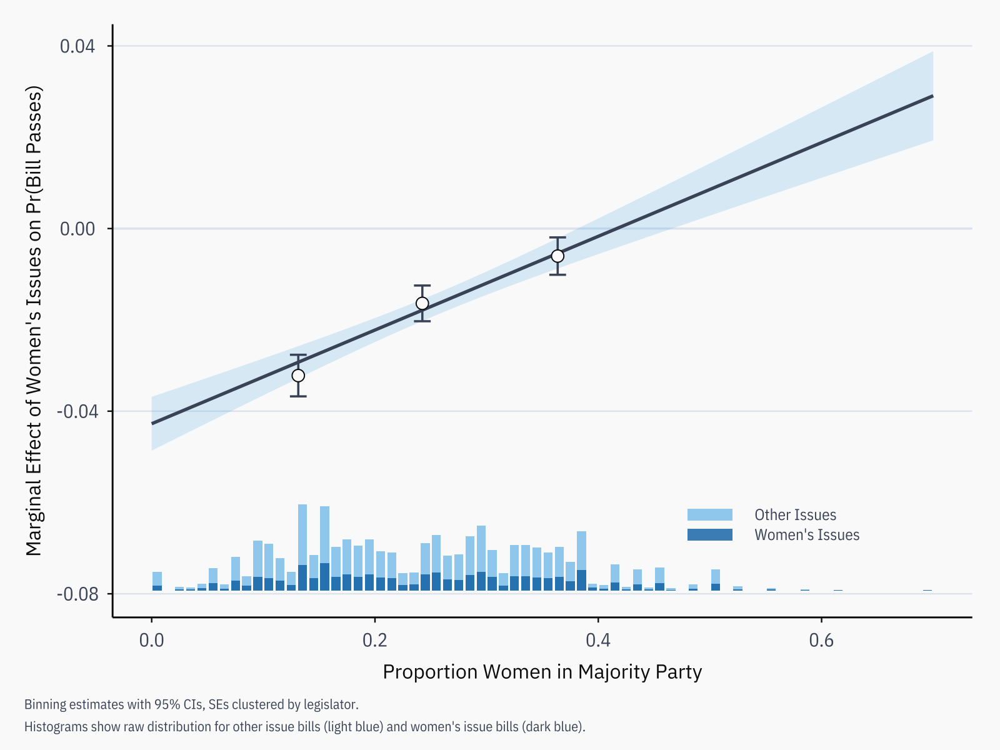

ISLES Figures
================
2026-05-10

- [Setup](#setup)
- [Figure 1 – Bills Introduced by
  Topic](#figure-1--bills-introduced-by-topic)
- [Figure 2 – Percent Enacted into
  Law](#figure-2--percent-enacted-into-law)
- [Figure 3 – Gender Effect on Issue-Specific
  SLES](#figure-3--gender-effect-on-issue-specific-sles)
- [Figure 4 – Balanced Fates in More Balanced
  Chambers](#figure-4--balanced-fates-in-more-balanced-chambers)
- [Figure 5 – Female Lawmakers Excel on Women’s
  Issues](#figure-5--female-lawmakers-excel-on-womens-issues)
- [Supplemental Test: Nonlinear Critical Mass Test with
  Interflex](#supplemental-test-nonlinear-critical-mass-test-with-interflex)

## Setup

``` r
library(tidyverse)
library(magrittr)
library(haven)
library(labelled)
library(sandwich)
library(lmtest)
library(interflex)
library(showtext)
library(fixest)
library(broom)

setwd('/Users/mackenziedobson/Dropbox/ISLES-analyses-april-2026')
options(scipen = 999)

isles_raw <- read_dta('data/ISLES-individual-level-260102.dta')
```

``` r
font_add_google("IBM Plex Sans",           family = "plex")
font_add_google("IBM Plex Sans Condensed", family = "plex_cond")
showtext_auto()

font_body <- "plex"
font_cond <- "plex_cond"

isles_cols <- list(
  ink    = "#0D0D0D", slate  = "#4A5568", rule   = "#E2E8F0",
  bg     = "#FAFAFA", dem    = "#0072B2", rep    = "#D55E00",
  blue   = "#0072B2", orange = "#E69F00", green  = "#009E73",
  yellow = "#F0E442", sky    = "#56B4E9", vermil = "#D55E00",
  purple = "#CC79A7"
)

bills_pal <- c("Bills (failed)" = "#56B4E9", "Laws" = "#0072B2")

theme_isles <- function(base_size = 11, grid = "h", axis_line = TRUE) {
  show_hgrid <- grepl("h", grid)
  show_vgrid <- grepl("v", grid)
  theme_minimal(base_size = base_size, base_family = font_body) %+replace%
    theme(
      plot.background  = element_rect(fill = isles_cols$bg, color = NA),
      panel.background = element_rect(fill = isles_cols$bg, color = NA),
      panel.border     = element_blank(),
      panel.grid.major.y = if (show_hgrid) element_line(color = isles_cols$rule, linewidth = 0.4) else element_blank(),
      panel.grid.major.x = if (show_vgrid) element_line(color = isles_cols$rule, linewidth = 0.4) else element_blank(),
      panel.grid.minor = element_blank(),
      axis.line         = if (axis_line) element_line(color = isles_cols$ink, linewidth = 0.5) else element_blank(),
      axis.ticks        = element_line(color = isles_cols$ink, linewidth = 0.4),
      axis.ticks.length = unit(3, "pt"),
      axis.text         = element_text(family = font_cond, size = base_size * 1.0, color = isles_cols$slate),
      axis.text.x       = element_text(margin = margin(t = 4)),
      axis.text.y       = element_text(margin = margin(r = 4)),
      axis.title        = element_text(family = font_body, size = base_size * 1.05, color = isles_cols$ink),
      axis.title.x      = element_text(margin = margin(t = 8)),
      axis.title.y      = element_text(margin = margin(r = 8), angle = 90),
      plot.title        = element_text(family = font_body, size = base_size * 1.25, color = isles_cols$ink,
                                       face = "bold", hjust = 0, margin = margin(b = 4)),
      plot.caption      = element_text(family = font_cond, size = base_size * 0.72, color = isles_cols$slate,
                                       hjust = 0, margin = margin(t = 10), lineheight = 1.35),
      plot.caption.position = "plot",
      plot.title.position   = "plot",
      legend.background = element_rect(fill = isles_cols$bg, color = NA),
      legend.key        = element_rect(fill = isles_cols$bg, color = NA),
      legend.text       = element_text(family = font_cond, size = base_size * 1.0, color = isles_cols$slate),
      legend.position   = "top", legend.direction = "horizontal",
      legend.key.size   = unit(10, "pt"), legend.spacing.x = unit(4, "pt"),
      plot.margin = margin(14, 16, 10, 14)
    )
}

theme_isles_coef <- function(base_size = 11) {
  theme_isles(base_size = base_size, grid = "v", axis_line = FALSE) %+replace%
    theme(
      panel.grid.major.x = element_line(color = isles_cols$rule, linewidth = 0.4),
      panel.border       = element_rect(color = isles_cols$rule, fill = NA, linewidth = 0.6),
      axis.line.y  = element_blank(), axis.ticks.y = element_blank(),
      axis.text.y  = element_text(family = font_cond, size = base_size * 1.0,
                                  color = isles_cols$ink, hjust = 1)
    )
}
```

``` r
# Column-name-safe labels for pivot (no special chars)
major_labels <- c(
  "1" = "Macroeconomics", "2" = "Civil Rights",    "3" = "Health",
  "4" = "Agriculture",    "5" = "Labor",            "6" = "Education",
  "7" = "Environment",    "8" = "Energy",           "10" = "Transportation",
  "12" = "Law and Crime", "13" = "Welfare",         "14" = "Housing",
  "15" = "Commerce",      "16" = "Defense",         "17" = "Technology",
  "20" = "Government Operations", "21" = "Public Lands", "24" = "Local Matters"
)

# Short display labels for Figures 1 & 2
display_labels <- c(
  "Macroeconomics" = "Macroeconomics", "Civil Rights" = "Civil Rights",
  "Health" = "Health",                 "Agriculture" = "Agriculture",
  "Labor" = "Labor",                   "Education" = "Education",
  "Environment" = "Environment",       "Energy" = "Energy",
  "Transportation" = "Transportation", "Law and Crime" = "Law & Crime",
  "Welfare" = "Welfare",               "Housing" = "Housing",
  "Commerce" = "Commerce",             "Defense" = "Defense",
  "Technology" = "Technology",         "Government Operations" = "Government Ops",
  "Public Lands" = "Public Lands",     "Local Matters" = "Local Government"
)

# Wide-format labels for Figure 3
issue_labels <- c(
  sles_macroeconomics = "Macroeconomics", sles_civil_rights = "Civil Rights",
  sles_health = "Health",                 sles_agriculture = "Agriculture",
  sles_labor = "Labor",                   sles_education = "Education",
  sles_environment = "Environment",       sles_energy = "Energy",
  sles_transportation = "Transportation", sles_law_and_crime = "Law & Crime",
  sles_welfare = "Welfare",               sles_housing = "Housing",
  sles_commerce = "Commerce",             sles_defense = "Defense",
  sles_technology = "Technology",         sles_government_operations = "Government Ops",
  sles_public_lands = "Public Lands",     sles_local_matters = "Local Government"
)
```

``` r
isles <- isles_raw %>%
  filter(!is.na(isles)) %>%
  mutate(
    afam              = as.integer(predrace == "black"),
    hispanic          = as.integer(predrace == "hispanic"),
    vote_share_sq     = vote_share ^ 2,
    positiveintros    = as.integer(all_bills > 0),
    ideo_med_distance = as.numeric(ideo_med_distance),
    major_label       = major_labels[as.character(major)],
    state_chamber_num = as.integer(factor(state_chamber))
  ) %>%
  arrange(state_chamber, biennial_grps) %>%
  group_by(state_chamber, biennial_grps) %>%
  mutate(
    propwomen    = mean(female, na.rm = TRUE),
    propmajwomen = sum(in_majority * female, na.rm = TRUE) /
                     sum(in_majority, na.rm = TRUE)
  ) %>%
  ungroup()

isles_wide <- isles %>%
  select(sles_id, state_chamber, biennial_grps, major_label, isles,
         female, seniority, comm_chair, in_majority, leader_majleader,
         leader_minleader, leader_speakerpres, power_comm, ideo_med_distance,
         afam, hispanic, vote_share, vote_share_sq) %>%
  pivot_wider(names_from = major_label, values_from = isles) %>%
  rename_with(
    ~ paste0("sles_", str_to_lower(.) %>% str_replace_all(" ", "_")),
    !c(sles_id, state_chamber, biennial_grps, female, seniority, comm_chair,
       in_majority, leader_majleader, leader_minleader, leader_speakerpres,
       power_comm, ideo_med_distance, afam, hispanic, vote_share, vote_share_sq)
  )

isles_bills <- isles %>%
  filter(all_bills > 0) %>%
  uncount(all_bills, .remove = FALSE) %>%
  group_by(sles_id, biennial_grps, major) %>%
  mutate(obs_expand = row_number()) %>%
  ungroup() %>%
  mutate(
    dvaic      = as.integer(all_aic  >= obs_expand),
    dvabc      = as.integer(all_abc  >= obs_expand),
    dvpass     = as.integer(all_pass >= obs_expand),
    dvlaw      = as.integer(all_law  >= obs_expand),
    womenissue = as.integer(major %in% c(2, 3, 6, 13))
  )
```

------------------------------------------------------------------------

## Figure 1 – Bills Introduced by Topic

``` r
fig1_wide <- isles %>%
  group_by(major_label) %>%
  summarise(bills = mean(all_bills, na.rm = TRUE),
            laws  = mean(all_law,   na.rm = TRUE), .groups = "drop") %>%
  mutate(failed      = bills - laws,
         major_label = recode(major_label, !!!display_labels),
         major_label = fct_reorder(major_label, bills, .desc = TRUE))

fig1_wide %>%
  pivot_longer(c(failed, laws), names_to = "series", values_to = "value") %>%
  mutate(series = factor(series, levels = c("failed", "laws"),
                         labels = c("Bills (failed)", "Laws"))) %>%
  ggplot(aes(x = major_label, y = value, fill = series)) +
  geom_col(position = "stack", width = 0.72) +
  scale_fill_manual(values = bills_pal) +
  scale_y_continuous(expand = expansion(mult = c(0, 0.04)),
                     breaks = scales::pretty_breaks(n = 5)) +
  labs(x = NULL, y = "Number of Bills Introduced", fill = NULL) +
  theme_isles() +
  theme(axis.text.x = element_text(angle = 45, hjust = 1, vjust = 1),
        plot.margin = margin(14, 16, 20, 14), legend.position = "bottom")
```

<!-- -->

------------------------------------------------------------------------

## Figure 2 – Percent Enacted into Law

``` r
isles %>%
  group_by(major_label) %>%
  summarise(all_bills = sum(all_bills, na.rm = TRUE),
            all_law   = sum(all_law,   na.rm = TRUE), .groups = "drop") %>%
  mutate(perc_laws   = (all_law / all_bills) * 100,
         major_label = recode(major_label, !!!display_labels),
         major_label = fct_reorder(major_label, perc_laws, .desc = TRUE)) %>%
  ggplot(aes(x = major_label, y = perc_laws)) +
  geom_col(fill = isles_cols$blue, width = 0.72) +
  scale_y_continuous(expand = expansion(mult = c(0, 0.04)),
                     breaks = scales::pretty_breaks(n = 5)) +
  labs(x = NULL, y = "Percent of Bills Enacted into Law") +
  theme_isles() +
  theme(axis.text.x = element_text(angle = 45, hjust = 1, vjust = 1),
        plot.margin = margin(14, 16, 20, 14))
```

<!-- -->

------------------------------------------------------------------------

## Figure 3 – Gender Effect on Issue-Specific SLES

``` r
dv_list <- names(issue_labels)

fit_one_female <- function(dv) {
  feols(as.formula(paste0(
    dv, " ~ female + seniority + comm_chair + in_majority + ",
    "leader_majleader + leader_minleader + leader_speakerpres + power_comm + ",
    "ideo_med_distance + afam + hispanic + vote_share + vote_share_sq | ",
    "state_chamber + biennial_grps")), data = isles_wide, cluster = ~sles_id)
}

mods_female <- lapply(dv_list, fit_one_female) %>% set_names(dv_list)

bind_rows(lapply(names(mods_female), function(dv) {
  tidy(mods_female[[dv]], conf.int = TRUE) %>%
    filter(term == "female") %>% mutate(outcome = dv)
})) %>%
  select(outcome, estimate, conf.low, conf.high) %>%
  distinct() %>%
  mutate(outcome_lab = recode(outcome, !!!issue_labels),
         outcome_lab = fct_reorder(outcome_lab, estimate)) %>%
  ggplot(aes(x = estimate, y = outcome_lab)) +
  geom_vline(xintercept = 0, linewidth = 0.8, color = isles_cols$blue,
             linetype = "dashed") +
  geom_errorbarh(aes(xmin = conf.low, xmax = conf.high),
                 height = 0.22, linewidth = 0.55, color = isles_cols$slate) +
  geom_point(color = isles_cols$ink, size = 2.8) +
  scale_x_continuous(limits = function(x) c(-max(abs(x)), max(abs(x))),
                     breaks = scales::pretty_breaks(n = 6)) +
  labs(x = "Coefficient (Women vs. Men)", y = NULL) +
  theme_isles_coef()
```

<!-- -->

------------------------------------------------------------------------

## Figure 4 – Balanced Fates in More Balanced Chambers

``` r
mod_fig4 <- lm(
  dvpass ~ womenissue * propwomen + female + in_majority + seniority +
    comm_chair + leader_majleader + leader_minleader + leader_speakerpres +
    ideo_med_distance + power_comm + afam + hispanic + vote_share + vote_share_sq +
    factor(state_chamber_num) + factor(biennial_grps),
  data = isles_bills
)

cov_means4 <- isles_bills %>%
  summarise(across(c(female, in_majority, seniority, comm_chair, leader_majleader,
                     leader_minleader, leader_speakerpres, ideo_med_distance,
                     power_comm, afam, hispanic, vote_share, vote_share_sq),
                   ~ mean(.x, na.rm = TRUE)))

chamber_fe_vals <- isles_bills %>%
  distinct(state_chamber_num, biennial_grps) %>%
  mutate(pred_test = predict(mod_fig4, newdata = bind_cols(
    data.frame(state_chamber_num = state_chamber_num, biennial_grps = biennial_grps),
    cov_means4, data.frame(propwomen = 0.25, womenissue = 0))))

target4  <- mean(predict(mod_fig4, newdata = isles_bills %>%
                           mutate(propwomen = 0.25, womenissue = 0)), na.rm = TRUE)
best_fe4 <- chamber_fe_vals %>% mutate(diff = abs(pred_test - target4)) %>%
  slice_min(diff, n = 1)

pred_list4_se <- expand.grid(propwomen = seq(0.1, 0.4, by = 0.1),
                             womenissue = c(0, 1)) %>% as_tibble() %>%
  bind_cols(cov_means4[rep(1, 8), ]) %>%
  mutate(state_chamber_num = best_fe4$state_chamber_num,
         biennial_grps = best_fe4$biennial_grps)

se_preds4 <- predict(mod_fig4, newdata = pred_list4_se, se.fit = TRUE)

preds <- expand.grid(propwomen = seq(0.1, 0.4, by = 0.1),
                     womenissue = c(0, 1)) %>% as_tibble() %>%
  rowwise() %>%
  mutate(estimate = {
    tmp <- isles_bills; tmp$propwomen <- propwomen; tmp$womenissue <- womenissue
    mean(predict(mod_fig4, newdata = tmp), na.rm = TRUE)
  }) %>%
  ungroup() %>%
  mutate(se = se_preds4$se.fit, conf.low = estimate - 1.96 * se,
         conf.high = estimate + 1.96 * se,
         issue_lab = factor(womenissue, levels = c(0, 1),
                            labels = c("Other Issues", "Women's Issues")))
```

``` r
ggplot(preds, aes(x = propwomen, y = estimate,
                  color = issue_lab, linetype = issue_lab)) +
  geom_line(linewidth = 1.0) + geom_point(size = 2.5) +
  geom_errorbar(aes(ymin = conf.low, ymax = conf.high),
                width = 0.012, linewidth = 0.6) +
  scale_color_manual(values = c("Other Issues" = isles_cols$ink,
                                "Women's Issues" = isles_cols$blue), name = NULL) +
  scale_linetype_manual(values = c("Other Issues" = "solid",
                                   "Women's Issues" = "dotted"), name = NULL) +
  scale_x_continuous(breaks = seq(0.1, 0.4, by = 0.1),
                     labels = c(".1", ".2", ".3", ".4")) +
  scale_y_continuous(limits = c(0.22, 0.32), breaks = seq(0.22, 0.32, by = 0.02)) +
  labs(x = "Proportion Women in Chamber", y = "Predicted Probability Bill Passes") +
  theme_isles() +
  theme(legend.position = "inside", legend.position.inside = c(0.8, 0.91))
```

<!-- -->

------------------------------------------------------------------------

## Figure 5 – Female Lawmakers Excel on Women’s Issues

``` r
mod_fig5 <- lm(
  dvpass ~ female * propwomen + in_majority + seniority + comm_chair +
    leader_majleader + leader_minleader + leader_speakerpres + ideo_med_distance +
    power_comm + afam + hispanic + vote_share + vote_share_sq +
    factor(state_chamber_num) + factor(biennial_grps),
  data = isles_bills %>% filter(womenissue == 1)
)

cov_means5 <- isles_bills %>% filter(womenissue == 1) %>%
  summarise(across(c(in_majority, seniority, comm_chair, leader_majleader,
                     leader_minleader, leader_speakerpres, ideo_med_distance,
                     power_comm, afam, hispanic, vote_share, vote_share_sq),
                   ~ mean(.x, na.rm = TRUE)))

modal_chamber5 <- as.integer(names(sort(table(
  isles_bills %>% filter(womenissue == 1) %>% pull(state_chamber_num)),
  decreasing = TRUE))[1])
modal_term5 <- as.integer(names(sort(table(
  isles_bills %>% filter(womenissue == 1) %>% pull(biennial_grps)),
  decreasing = TRUE))[1])

pred_list5_se <- expand.grid(propwomen = seq(0.1, 0.4, by = 0.1),
                             female = c(0, 1)) %>% as_tibble() %>%
  bind_cols(cov_means5[rep(1, 8), ]) %>%
  mutate(state_chamber_num = modal_chamber5, biennial_grps = modal_term5)

se_preds5 <- predict(mod_fig5, newdata = pred_list5_se, se.fit = TRUE)

preds5 <- expand.grid(propwomen = seq(0.1, 0.4, by = 0.1),
                      female = c(0, 1)) %>% as_tibble() %>%
  rowwise() %>%
  mutate(estimate = {
    tmp <- isles_bills %>% filter(womenissue == 1)
    tmp$propwomen <- propwomen; tmp$female <- female
    mean(predict(mod_fig5, newdata = tmp), na.rm = TRUE)
  }) %>%
  ungroup() %>%
  mutate(se = se_preds5$se.fit, conf.low = estimate - 1.96 * se,
         conf.high = estimate + 1.96 * se,
         sponsor = factor(female, levels = c(0, 1),
                          labels = c("Men Sponsors", "Women Sponsors")))
```

``` r
ggplot(preds5, aes(x = propwomen, y = estimate,
                   color = sponsor, linetype = sponsor)) +
  geom_line(linewidth = 1.0) + geom_point(size = 2.5) +
  geom_errorbar(aes(ymin = conf.low, ymax = conf.high),
                width = 0.012, linewidth = 0.6) +
  scale_color_manual(values = c("Men Sponsors" = isles_cols$ink,
                                "Women Sponsors" = isles_cols$blue), name = NULL) +
  scale_linetype_manual(values = c("Men Sponsors" = "solid",
                                   "Women Sponsors" = "dotted"), name = NULL) +
  scale_x_continuous(breaks = seq(0.1, 0.4, by = 0.1),
                     labels = c(".1", ".2", ".3", ".4")) +
  scale_y_continuous(limits = c(0.20, 0.32), breaks = seq(0.20, 0.32, by = 0.02)) +
  labs(x = "Proportion Women in Chamber", y = "Predicted Probability Bill Passes") +
  theme_isles() +
  theme(legend.position = "inside", legend.position.inside = c(0.2, 0.88))
```

<!-- -->

------------------------------------------------------------------------

## Supplemental Test: Nonlinear Critical Mass Test with Interflex

``` r
isles_bills_if <- isles_bills %>%
  zap_labels() %>% zap_label() %>%
  select(where(~ !is.list(.))) %>% as.data.frame()

out_if <- interflex(
  estimator = "binning", data = isles_bills_if,
  Y = "dvpass", D = "womenissue", X = "propmajwomen",
  Z = c("female", "in_majority", "seniority", "comm_chair", "leader_majleader",
        "leader_minleader", "leader_speakerpres", "ideo_med_distance",
        "power_comm", "afam", "hispanic", "vote_share", "vote_share_sq"),
  FE = c("state_chamber_num", "biennial_grps"), cl = "sles_id",
  na.rm = TRUE, theme.bw = TRUE
)
```

    ## Baseline group not specified; choose treat = 0 as the baseline group.

``` r
bin_data    <- as.data.frame(out_if$est.bin[["1"]]) %>%
  rename(X.center = x0, ME = coef, CI.lower = CI.lower, CI.upper = CI.upper)
linear_data <- as.data.frame(out_if$est.lin[["1"]]) %>%
  rename(X = X, ME = TE, CI.lower = `lower CI(95%)`, CI.upper = `upper CI(95%)`)

max_count <- max(out_if$hist.out$counts)
y_min     <- min(linear_data$CI.lower, bin_data$CI.lower, na.rm = TRUE)
y_range   <- diff(range(c(linear_data$CI.upper, linear_data$CI.lower), na.rm = TRUE))

hist_control <- data.frame(x = out_if$hist.out$mids,
                           count = out_if$count.tr[["0"]]) %>%
  mutate(density = count / max_count,
         y_bottom = y_min - y_range * 0.35,
         y_top    = y_min - y_range * 0.35 + density * y_range * 0.28)

hist_treat <- data.frame(x = out_if$hist.out$mids,
                         count = out_if$count.tr[["1"]]) %>%
  mutate(density = count / max_count,
         y_bottom = y_min - y_range * 0.35,
         y_top    = y_min - y_range * 0.35 + density * y_range * 0.28)

ggplot() +
  geom_rect(data = hist_control,
            aes(xmin = x - 0.004, xmax = x + 0.004, ymin = y_bottom, ymax = y_top),
            fill = isles_cols$sky, alpha = 0.6, color = NA) +
  geom_rect(data = hist_treat,
            aes(xmin = x - 0.004, xmax = x + 0.004, ymin = y_bottom, ymax = y_top),
            fill = isles_cols$blue, alpha = 0.8, color = NA) +
  geom_hline(yintercept = 0, color = isles_cols$rule, linewidth = 0.6) +
  geom_ribbon(data = linear_data, aes(x = X, ymin = CI.lower, ymax = CI.upper),
              fill = isles_cols$sky, alpha = 0.2) +
  geom_line(data = linear_data, aes(x = X, y = ME),
            color = isles_cols$slate, linewidth = 0.9) +
  geom_errorbar(data = bin_data,
                aes(x = X.center, ymin = CI.lower, ymax = CI.upper),
                width = 0.015, linewidth = 0.6, color = isles_cols$slate) +
  geom_point(data = bin_data, aes(x = X.center, y = ME),
             size = 3, shape = 21, color = isles_cols$ink, fill = isles_cols$bg) +
  annotate("rect", xmin = 0.48, xmax = 0.52,
           ymin = y_min - y_range * 0.175, ymax = y_min - y_range * 0.145,
           fill = isles_cols$sky, alpha = 0.6) +
  annotate("text", x = 0.54, y = y_min - y_range * 0.160, hjust = 0,
           size = 3.2, family = font_cond, color = isles_cols$slate,
           label = "Other Issues") +
  annotate("rect", xmin = 0.48, xmax = 0.52,
           ymin = y_min - y_range * 0.225, ymax = y_min - y_range * 0.195,
           fill = isles_cols$blue, alpha = 0.8) +
  annotate("text", x = 0.54, y = y_min - y_range * 0.210, hjust = 0,
           size = 3.2, family = font_cond, color = isles_cols$slate,
           label = "Women's Issues") +
  labs(x = "Proportion Women in Majority Party",
       y = "Marginal Effect of Women's Issues on Pr(Bill Passes)",
       caption = "Binning estimates with 95% CIs, SEs clustered by legislator.\nHistograms show raw distribution for other issue bills (light blue) and women's issue bills (dark blue).") +
  theme_isles()
```

<!-- -->
